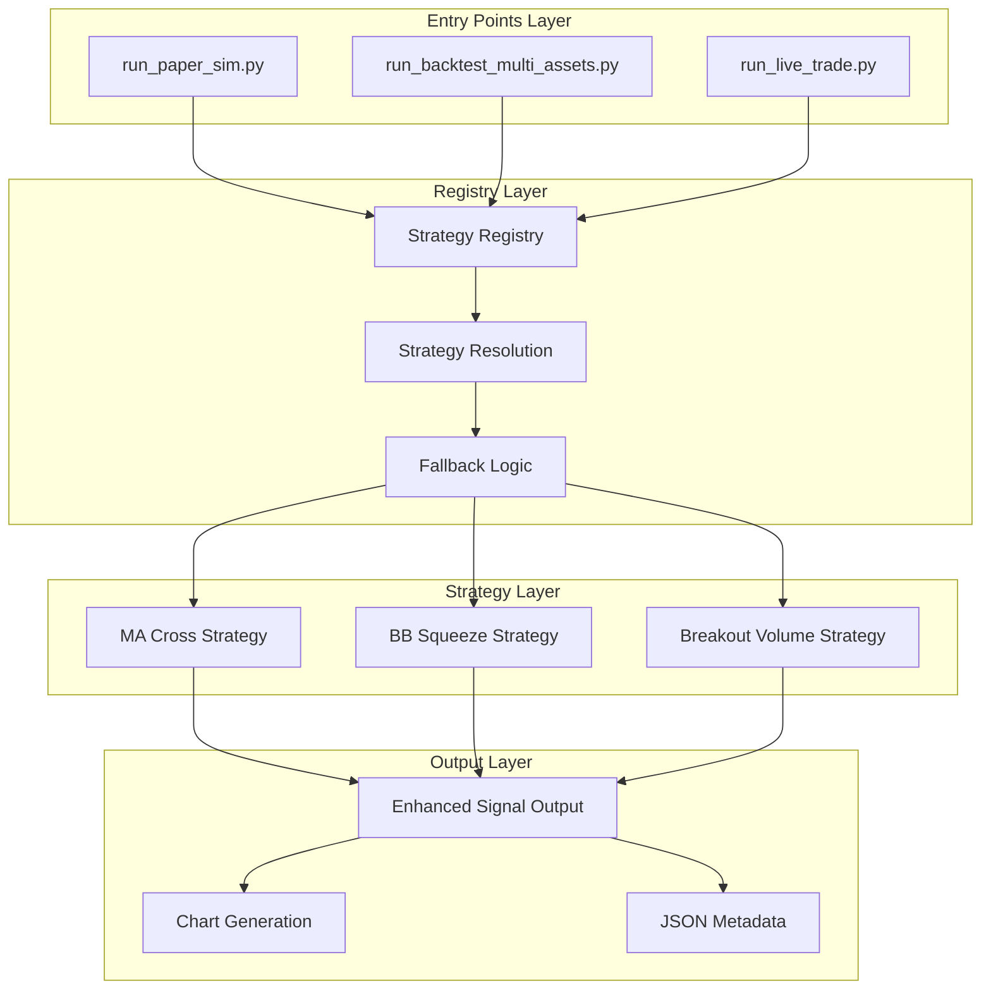

# Design Document: Trader Strategy Plugin System

## Overview

The Trader Strategy Plugin system transforms the existing hardcoded MA cross trading system into a flexible, pluggable architecture. The design maintains full backward compatibility while enabling strategy switching across all trading modes (paper, backtest, live) through a centralized registry system.

The architecture introduces a Strategy Protocol interface, a centralized registry with automatic fallback logic, and enhanced signal output with strategy metadata. The system addresses critical go/no-go risk guard issues in paper mode and provides clean repository output through configurable report directories.

Key design principles:
- **Plugin Architecture**: Modular strategies following a common interface
- **Universal Integration**: Same strategy selection across all entry points  
- **Automatic Fallback**: Volume-dependent strategies gracefully degrade
- **Enhanced Output**: Rich signal metadata with trade levels
- **Backward Compatibility**: Existing functionality preserved

## Architecture

The system follows a registry-based plugin architecture with three main layers:



### Registry-Based Discovery

The Strategy Registry serves as the central hub for strategy management:
- **Strategy Discovery**: Enumerates available strategies with metadata
- **Instance Creation**: Instantiates strategies with parameter validation
- **Fallback Resolution**: Handles volume dependency and automatic downgrades
- **Parameter Schema**: Provides configuration metadata for each strategy

### Universal Entry Point Integration

All trading entry points (paper, backtest, live) integrate with the registry through a common pattern:
- CLI argument parsing for `--strategy` parameter
- Environment variable support via `TRADER_STRATEGY`
- Default strategy resolution (bb_squeeze)
- Parameter passing to strategy instances

## Components and Interfaces

### Strategy Protocol Interface

```python
from typing import Protocol, Dict, Any, Optional
from dataclasses import dataclass
import pandas as pd

@dataclass
class StrategyResult:
    signal: int                    # -1=sell, 0=hold, 1=buy
    entry: Optional[float]         # recommended entry price
    stop: Optional[float]          # stop loss level
    confidence: float              # signal strength 0.0-1.0
    meta: Dict[str, Any]          # reasons, indicators, etc.

class Strategy(Protocol):
    def compute(self, df: pd.DataFrame, **params) -> StrategyResult:
        """Compute trading signal from OHLCV data"""
        ...
    
    @property
    def requires_volume(self) -> bool:
        """Whether strategy needs volume data"""
        ...
    
    @property
    def default_params(self) -> Dict[str, Any]:
        """Default parameter values"""
        ...
    
    @property
    def param_schema(self) -> Dict[str, Any]:
        """JSON schema for parameters"""
        ...
```

### Strategy Registry

```python
from typing import Dict, List, Optional, Any
from dataclasses import dataclass

@dataclass
class StrategyInfo:
    id: str
    name: str
    description: str
    recommended: bool
    requires_volume: bool
    param_schema: Dict[str, Any]

class StrategyRegistry:
    def get_strategy(self, strategy_id: str) -> Strategy:
        """Get strategy instance by ID"""
        ...
    
    def list_strategies(self) -> List[StrategyInfo]:
        """List all available strategies"""
        ...
    
    def resolve_strategy(self, strategy_id: str, df: pd.DataFrame) -> Strategy:
        """Resolve strategy with volume fallback logic"""
        ...
```

### Strategy Implementations

#### BB Squeeze Strategy
- **Algorithm**: Bollinger Band squeeze detection with volatility expansion
- **Indicators**: Bollinger Bands (20, 2.0), ATR for volatility measurement
- **Entry Logic**: Buy when bands expand after squeeze (low volatility period)
- **Volume Requirement**: None (works with price data only)
- **Parameters**: bb_period (20), bb_std (2.0), squeeze_threshold (0.1)

#### Breakout Volume Strategy  
- **Algorithm**: Range breakout confirmation with volume filter
- **Indicators**: Price range (high/low), volume moving average
- **Entry Logic**: Buy on range breakout with above-average volume
- **Volume Requirement**: Required (fallback to bb_squeeze if missing)
- **Parameters**: lookback_period (20), volume_threshold (1.5)

#### MA Cross Strategy (Legacy)
- **Algorithm**: Moving average crossover (existing implementation)
- **Indicators**: Short MA, Long MA
- **Entry Logic**: Buy when short MA crosses above long MA
- **Volume Requirement**: None
- **Parameters**: ma_short (20), ma_long (100)

## Data Models

### Enhanced Signal Output Structure

```python
@dataclass
class SignalOutput:
    # Core signal data
    strategy_id: str
    signal: int                    # -1, 0, 1
    timestamp_utc: str
    price: float
    
    # Strategy metadata
    reasons: List[str]             # decision rationale
    entry: Optional[float]         # entry price level
    stop: Optional[float]          # stop loss level  
    confidence: float              # 0.0-1.0
    
    # Technical indicators
    indicators: Dict[str, float]   # strategy-specific values
    
    # Existing compatibility fields
    symbol: str
    interval: str
    generated_at_utc: str
    data_last_timestamp_utc: str
```

### Strategy Parameter Schema

```python
# BB Squeeze parameters
BB_SQUEEZE_SCHEMA = {
    "type": "object",
    "properties": {
        "bb_period": {"type": "integer", "default": 20, "minimum": 5},
        "bb_std": {"type": "number", "default": 2.0, "minimum": 0.5},
        "squeeze_threshold": {"type": "number", "default": 0.1, "minimum": 0.01}
    }
}

# Breakout Volume parameters  
BREAKOUT_VOLUME_SCHEMA = {
    "type": "object", 
    "properties": {
        "lookback_period": {"type": "integer", "default": 20, "minimum": 5},
        "volume_threshold": {"type": "number", "default": 1.5, "minimum": 1.0}
    }
}
```

### Configuration Integration

```python
@dataclass
class TraderConfig:
    # Existing fields...
    
    # New strategy fields
    strategy_id: str = "bb_squeeze"
    strategy_params: Dict[str, Any] = None
    
    def __post_init__(self):
        # Existing logic...
        
        # Strategy configuration
        self.strategy_id = os.getenv("TRADER_STRATEGY", self.strategy_id)
        
        # Parse strategy parameters from environment
        strategy_params_env = os.getenv("TRADER_STRATEGY_PARAMS")
        if strategy_params_env:
            import json
            self.strategy_params = json.loads(strategy_params_env)
        elif self.strategy_params is None:
            self.strategy_params = {}
```

## Correctness Properties

*A property is a characteristic or behavior that should hold true across all valid executions of a system-essentially, a formal statement about what the system should do. Properties serve as the bridge between human-readable specifications and machine-verifiable correctness guarantees.*

Now I need to use the prework tool to analyze the acceptance criteria before writing the correctness properties:

Based on the prework analysis, the following correctness properties validate the system requirements:

### Property 1: Strategy Registry Interface Completeness
*For any* strategy registry instance, it should provide get_strategy, list_strategies, and resolve_strategy methods that return appropriate types and handle both valid and invalid inputs correctly
**Validates: Requirements 1.1, 1.2, 1.3**

### Property 2: Volume Fallback Consistency  
*For any* strategy that requires volume data, when provided with a DataFrame lacking volume columns, the registry should consistently fallback to bb_squeeze strategy
**Validates: Requirements 1.4, 2.5**

### Property 3: Strategy Interface Compliance
*For any* implemented strategy, calling compute with valid DataFrame and parameters should return a StrategyResult object with all required fields (signal, entry, stop, confidence, meta)
**Validates: Requirements 1.5, 1.6**

### Property 4: Strategy Implementation Availability
*For any* of the required strategies (bb_squeeze, breakout_volume, ma_cross), the registry should be able to instantiate them and they should produce valid results for appropriate inputs
**Validates: Requirements 2.1, 2.2, 2.3, 7.2**

### Property 5: Volume Independence for BB Squeeze
*For any* DataFrame without volume columns, the bb_squeeze strategy should process it successfully and return valid StrategyResult objects
**Validates: Requirements 2.4**

### Property 6: Default Strategy Resolution
*For any* entry point or registry call without explicit strategy specification, the system should resolve to bb_squeeze strategy
**Validates: Requirements 2.6, 3.4, 7.1**

### Property 7: Universal Entry Point Strategy Support
*For any* of the three entry points (run_paper_sim, run_backtest_multi_assets, run_live_trade), providing the same strategy configuration should result in the same strategy being selected and used
**Validates: Requirements 3.1, 3.2, 3.3, 3.5**

### Property 8: Enhanced Signal Output Completeness
*For any* generated signal output, the signals_latest.json file should contain all required fields: strategy_id, signal, reasons, entry, stop, confidence, plus all existing legacy fields for backward compatibility
**Validates: Requirements 4.1, 4.2, 4.3, 4.4, 4.5, 4.6, 7.5**

### Property 9: Paper Mode Risk Guard Tolerance
*For any* go/no-go check in paper mode, missing live_summary_latest.txt or risk_guard values of SKIP/missing should result in PASS, and only explicit FAIL should cause failure
**Validates: Requirements 5.1, 5.2, 5.3, 5.5**

### Property 10: Non-Paper Mode Risk Guard Preservation
*For any* go/no-go check in testnet or live mode, the risk_guard validation should behave identically to the original implementation
**Validates: Requirements 5.4**

### Property 11: Configurable Output Directory Handling
*For any* output file generation, when TRADER_REPORTS_DIR is set, files should be written there; when unset, files should go to trader/reports directory
**Validates: Requirements 6.1, 6.2, 6.3, 6.4, 6.5, 6.6**

### Property 12: Backward Compatibility Preservation
*For any* existing CLI usage pattern or configuration that worked before, the system should continue to work identically when no strategy parameters are specified
**Validates: Requirements 7.3, 7.4**

### Property 13: Strategy Parameter Configuration
*For any* strategy with configurable parameters, providing different valid parameter values should affect the strategy computation appropriately, and the registry should provide parameter schema information
**Validates: Requirements 8.1, 8.2, 8.3, 8.4, 8.5**

## Error Handling

### Strategy Resolution Errors
- **Invalid Strategy ID**: Registry raises `StrategyNotFoundError` with available strategy list
- **Missing Volume Data**: Automatic fallback to bb_squeeze with warning log
- **Parameter Validation**: Strategy raises `ParameterValidationError` with schema details
- **Computation Errors**: Strategy returns StrategyResult with signal=0 and error in meta

### Entry Point Integration Errors
- **CLI Parsing**: Invalid strategy parameters show help text and available strategies
- **Environment Variables**: Malformed TRADER_STRATEGY_PARAMS logs warning and uses defaults
- **Strategy Instantiation**: Fallback to bb_squeeze with error notification

### Signal Output Errors
- **File Write Failures**: Atomic write with temporary files, rollback on failure
- **JSON Serialization**: Handle non-serializable values in meta fields gracefully
- **Chart Generation**: Continue operation if PNG generation fails, log warning

### Go/No-Go System Errors
- **File Access**: Handle missing/unreadable files gracefully in paper mode
- **Parse Errors**: Treat malformed live_summary_latest.txt as SKIP in paper mode
- **Mode Detection**: Default to safe behavior if trader_mode is unclear

## Testing Strategy

The testing approach combines unit tests for specific examples and edge cases with property-based tests for universal correctness validation.

### Unit Testing Focus
- **Strategy Examples**: Specific market scenarios with known expected outputs
- **Edge Cases**: Empty DataFrames, missing columns, boundary parameter values
- **Integration Points**: Entry point CLI parsing, file I/O operations
- **Error Conditions**: Invalid inputs, file system errors, malformed data

### Property-Based Testing Configuration
- **Library**: Use `hypothesis` for Python property-based testing
- **Iterations**: Minimum 100 iterations per property test
- **Test Tags**: Each property test tagged with format: **Feature: trader-strategy-plugin, Property N: [property description]**
- **Data Generation**: Custom generators for OHLCV DataFrames, strategy parameters, file system states

### Property Test Implementation
Each correctness property maps to a single property-based test:

```python
from hypothesis import given, strategies as st
import pandas as pd

@given(st.data())
def test_strategy_registry_interface_completeness(data):
    """Feature: trader-strategy-plugin, Property 1: Strategy Registry Interface Completeness"""
    registry = StrategyRegistry()
    
    # Test get_strategy with valid and invalid IDs
    valid_strategies = registry.list_strategies()
    strategy_id = data.draw(st.sampled_from([s.id for s in valid_strategies]))
    strategy = registry.get_strategy(strategy_id)
    assert isinstance(strategy, Strategy)
    
    # Test list_strategies returns complete metadata
    strategies = registry.list_strategies()
    for info in strategies:
        assert hasattr(info, 'id')
        assert hasattr(info, 'name') 
        assert hasattr(info, 'requires_volume')
        assert hasattr(info, 'param_schema')
```

### Test Coverage Requirements
- **Strategy Implementations**: 100% line coverage for all strategy compute methods
- **Registry Logic**: 100% branch coverage for fallback and resolution logic
- **Entry Point Integration**: All CLI argument combinations tested
- **Signal Output**: All JSON fields and chart generation paths covered
- **Go/No-Go Logic**: All paper mode conditions and non-paper mode preservation tested

### Integration Testing
- **End-to-End Workflows**: Complete trading simulation with each strategy
- **Cross-Entry Point Consistency**: Same strategy configuration across all entry points
- **File System Integration**: Output directory configuration and file generation
- **Environment Variable Handling**: All configuration combinations tested

The dual testing approach ensures both concrete correctness (unit tests) and universal properties (property-based tests) are validated, providing comprehensive coverage of the strategy plugin system.